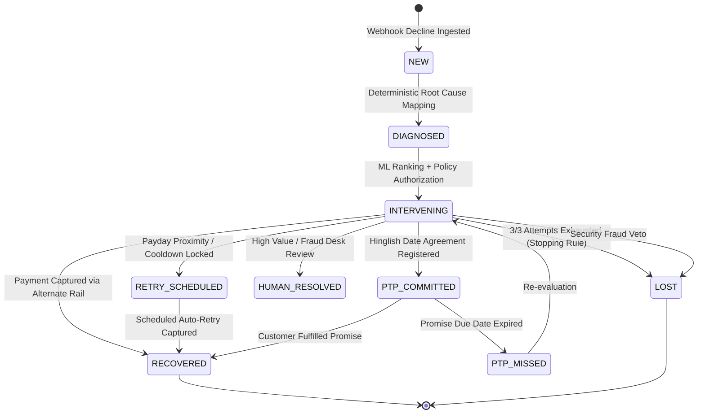

# Triage - Cross-Workflow AI Revenue Recovery Control Plane

[](https://drive.google.com/file/d/1uh3zhQRknUTt3QNnbQC6lrApSMwpoHKB/view?usp=sharing)
[](https://golang.org)
[](https://github.com/jhanvi857/Triage)
[](https://github.com/jhanvi857/Triage)

> **Autonomous cross-workflow AI revenue recovery control plane that diagnoses payment failures, dynamically times retries to customer liquidity windows, de-conflicts multi-surface dunning, and executes bounded recoveries with an immutable SHA-256 cryptographic audit trail.**

---

## 1. What Razorpay Has Today vs. What Triage Adds

| # | Capability | Razorpay Native Behavior (Official Docs) | Triage AI Control Plane (New) |
|:---:|---|---|---|
| **1** | **Cross-Workflow Coordination** | **Disjoint recovery cycles**: Razorpay shares a common `Customer` entity (`cust_xxx`) across products, but Subscriptions and the standalone Invoicing product (see *"About Subscriptions"* and *"About Invoices"* under [razorpay.com/docs/payments/](https://razorpay.com/docs/payments/)) run on independent state machines with no cross-product cooldown or suppression layer. | **Centralized Customer Control**: Coordinates recovery across all commercial surfaces; enforces a mandatory 4-hour global contact cooldown and value-ranked suppression. |
| **2** | **Dual-Gated Concession Solvency Engine** | **Static merchant offers**: Razorpay's Offers system (*"About Offers"*, under the same docs hub) supports flat/percentage discounts configured manually at the order level, not computed dynamically against an individual customer's solvency gap. | **2-Gate Knapsack Solver**: Gate 1 deterministic gap-closing check (`balance >= amount - concession`) + Gate 2 marginal ERV density portfolio budget allocator. |
| **3** | **Payday-Aware Adaptive Sequencer** | **Fixed daily schedule**: Razorpay Subscriptions' *"Payment Retries"* doc describes a fixed T+1, T+2, T+3 day cycle regardless of decline reason — not liquidity-timed. | **Payday Proximity Sequencer**: Times retries to customer salary liquidity windows (<= 3 days), executing debits when funds actually land in the bank account. |
| **4** | **Conversational Hinglish & Text-Based Promise-to-Pay (PTP)** | **Static SMS / email links**: Production dunning uses standard notification templates. Track 03 — "AI Revenue Recovery" — of the [Razorpay AI Buildathon](https://razorpay.com/buildathon) explicitly lists Hinglish voice recovery and a promise-to-pay tracker as example build directions, not shipped product behavior. | **Text NLP PTP Engine**: Extracts conversational dates from customer text (*"parso karunga"* / *"5 tarik"*) into structured schedules, tracking stateful `PTP_COMMITTED` → `RECOVERED`/`PTP_MISSED` transitions. *(Text-based — no voice component implemented.)* |
| **5** | **Instrument Invalidation Candidate Bounds** | **Blind daily retries**: same *"Payment Retries"* doc — retries on the same daily cycle until attempts exhaust and status becomes `halted`. No automatic instrument-pruning on permanent card expiry or bank revocation — only a manual "Update Payment Method" link sent post-halt. | **Strict Candidate Bounds**: Sets $\hat{P}(\text{recover} \mid \text{same rail}) = 0$ on expired cards/revoked mandates, pruning blind retries and shifting instantly to alternate rails or 1-click update links. |
| **6** | **Cryptographic Audit Ledger & Provenance** | **Ephemeral webhook retries**: Razorpay's Webhooks *"Best Practices"* doc confirms exponential backoff for 24 hours, then the webhook is disabled; lacks an immutable, cryptographic hash-chained audit trail. | **SHA-256 Audit Ledger**: Cryptographically hash-chained ledger storing state transitions, idempotency keys, and tamper-evident financial receipts over real-time SSE. |
| **7** | **Counterfactual Uplift Benchmark** | **Aggregate volume metrics**: Standard reports provide gross volume distribution and exportable transaction logs; public documentation describes no causal counterfactual policy benchmarking framework. | **3-Model Benchmark Harness**: Evaluates Ledger AI vs. Static Rule vs. Random Policy under identical held-out Bernoulli conditions, proving net recovery uplift ($p < 0.001$). |

---

## 2. Executive Overview: The 4 Core Problems Triage Solves

Digital merchants and subscription platforms lose **3% to 7% of gross revenue** to payment friction and uncoordinated dunning. Standard payment gateways process transactions efficiently, but handle declines via isolated product silos and static daily retry schedules.

### The 4 Real-World Failures & Triage Solutions:

1. **Blind Retries on Empty Accounts**:
   * *Problem*: Standard retries hit accounts on fixed calendar days (T+1, T+2), exhausting attempt quotas while the customer's account is still empty.
   * *Solution*: **Payday-Aware Adaptive Sequencer** detects customer salary/funding windows (<= 3 days) and locks auto-retries into the liquidity window when funds actually arrive.

2. **Dunning Collisions & Notification Fatigue**:
   * *Problem*: A single customer with a dropped cart, a failed subscription, and an overdue B2B invoice receives competing, disjoint dunning emails in the same hour.
   * *Solution*: **Centralized Customer Entity** enforces a mandatory **4-hour global contact cooldown** and value-ranked dunning suppression (prioritizing higher-value recoveries).

3. **Margin Burn from Blind Discounts**:
   * *Problem*: Flat discount links burn profit margin on customers who either do not need them or whose balance gap is too wide to close.
   * *Solution*: **Dual-Gated Knapsack Concession Engine** authorizes discounts *only* if the concession mathematically closes the shortfall (`balance >= amount - concession`) and fits the daily portfolio budget.

4. **Conversational Commitments Ignored**:
   * *Problem*: Customers explaining payment delays (e.g., *"5 tarik ko kar dunga"*) are treated as lost leads by automated systems.
   * *Solution*: **Hinglish NLP Promise-to-Pay (PTP) Engine** parses conversational commitments into stateful cron recovery schedules.

---

## 3. End-to-End Decision Flow & Authority Pipeline

Triage runs a strict 5-stage authority pipeline separating non-authoritative communication from authoritative idempotent execution. **ML decisions run directly inside the Go Gateway via an embedded Random Forest inference engine (<1ms latency) with dual-mode fallback to Python if active**:

```text
               REVENUE AT RISK SURFACES
 (Payment Degradation · Checkout Drop-off · Failed Subscription · B2B Overdue Invoice)
                                   │
                                   ▼
                            ┌──────────────┐
                            │ 1. DIAGNOSIS │
                            │What happened?│ → Deterministic failure mapping (8 Root Causes, 0 AI)
                            └──────┬───────┘
                                   │
                                   ▼
                           ┌───────────────┐
                           │ 2. ELIGIBILITY│
                           │What is possible│ → Context-aware candidate bounds & Gate 1 solvency check
                           └──────┬────────┘
                                   │
                                   ▼
                           ┌───────────────┐
                           │ 3. ML RANKING │
                           │What is better?│ → Embedded Random Forest (P̂); Expected Recovery Value (ERV)
                           └──────┬────────┘
                                   │
                                   ▼
                            ┌──────────────┐
                            │  4. POLICY   │
                            │What is allowed│ → Deterministic vetoes: max 3 attempts, ₹10k gate, fraud stop
                            └──────┬───────┘
                                   │
                                   ▼
                     5. APPROVED ACTION ENVELOPE
                     (Immutable Context & Boundary)
                                   │
                ┌──────────────────┴──────────────────┐
                │                                     │
                ▼                                     ▼
      COMMUNICATION BRANCH                    EXECUTION BRANCH
      (Non-Authoritative)                     (Authoritative / Idempotent)
                │                                     │
         ┌──────▼──────┐                       ┌──────▼──────┐
         │ 6. Template │                       │Deterministic│
         │    Nudge    │                       │  Executor   │
         └──────┬──────┘                       └──────┬──────┘
                │                                     │
         Output Validator                      Idempotency Check
                │                                     │
                ▼                                     ▼
         Customer Copy                         Authorized Recovery Action
                │                                     │
                ▼                                     ▼
         Customer Channel                      Razorpay API / Alternate Rail
                │                                     │
                └──────────────────┬──────────────────┘
                                   │
                                   ▼
                          7. OUTCOME + AUDIT
                         ┌───────────────────┐
                         │ Outcome Observer  │
                         │ SHA-256 Ledger    │
                         └───────────────────┘
```

### The 5 Stages of Recovery Decisioning

1. **Deterministic Diagnosis (0 AI)**:
   * Maps raw decline codes (`INSUFFICIENT_FUNDS`, `GATEWAY_TIMEOUT_504`, `TRANSACTION_TIMEOUT`, `LIMIT_EXCEEDED`, `CARD_EXPIRED`, `OVERDUE_INVOICE`) and step metadata into universal root causes. Zero hallucinations, 100% deterministic.

2. **Context-Aware Eligibility & Candidate Bounds**:
   * Inspects customer context: available balance, payday proximity, verified backup cards on file, UPI availability, and remaining attempt limits.
   * Enforces **Gate 1 Solvency Check** for discounts: $\text{AvailableBalance} < \text{InvoiceAmount}$ **AND** $\text{AvailableBalance} \ge \text{InvoiceAmount} - \min(0.05 \times \text{InvoiceAmount}, \text{₹}500)$.
   * Prunes impossible actions (e.g. 0 blind retries on expired cards).

3. **Embedded Random Forest ML Inference (<1ms, Pure Go)**:
   * **Inference Engine in Pure Go**: Vectorizes **12 raw contextual feature fields** (9 numerical/temporal: `amount_paise`, `attempt_number`, `time_since_failure_hours`, `day_of_week`, `hour`, `payday_proximity_days`, `historical_success_rate`, `previous_success_count`, `days_since_last_payment`; and 3 categorical: `cause`, `original_rail`, `candidate_action`), which expand via one-hot categorical encoding into a **34-dimensional feature vector** evaluated across all 100 decision trees of the trained `RandomForestClassifier` directly in pure Go (<1ms).
   * **Dual-Mode Microservice Architecture**: The gateway queries the Python ML microservice (`http://localhost:8000`) if online, with the embedded Go Random Forest engine executing seamlessly inside the binary for zero-overhead, zero-downtime inference.
   * Computes predicted recovery probability $\hat{P}(\text{recover} \mid \mathbf{x}, a)$ for every eligible action.
   * Computes net **Expected Recovery Value ($\text{ERV}$)**:
     $$\text{ERV} = \hat{P}(\text{recover} \mid \mathbf{x}, a) \times (\text{Amount} - \text{Discount})$$
   * Sorts candidate actions by descending $\text{ERV}$ to select the mathematically optimal intervention.

4. **Deterministic Policy Engine & Hard Vetoes**:
   * Evaluates 5 immutable safety rules:
     * `CANDIDATE_LEGITIMACY`: Proposed action must exist in the context-eligible set.
     * `MAX_ATTEMPTS_LIMIT`: Current attempts must be $< 3$. When reaching 3, enforces `MARK_LOST_EXHAUSTED`.
     * `FRAUD_SECURITY_GATE`: If root cause is `FRAUD_SUSPECTED`, immediately vetoes with `STOP`.
     * `HIGH_VALUE_THRESHOLD`: If amount $\ge \text{₹}10,000$, routes to Senior Retention Desk (`ESCALATE_HUMAN`).
     * `CONCESSION_BUDGET_CAP`: Any concession discount must be $\le 5\%$ AND $\le \text{₹}500$.

5. **Execution Envelope & Cryptographic SHA-256 Ledger**:
   * Executes authorized recovery actions via idempotent API calls (`idem_{case_id}`).
   * Broadcasts real-time `triage_log` events over SSE to the Live Operations dashboard.
   * Appends every state transition, policy decision, and financial settlement to the immutable SHA-256 hash-chained recovery ledger.

---

## 4. Cross-Surface Failure Scenarios & Resolutions

Every failure scenario maps to a deterministic eligibility envelope. Discounts and concessions are strictly gated and never offered outside their justified mathematical boundary.

| Revenue Loss Scenario | Root Cause Code | Primary Recovery Intervention | Discount Allowed? | Justification & Policy Rules |
|---|---|---|---|---|
| **Insufficient Balance** *(Solvency Gap)* | `INSUFFICIENT_FUNDS` | **`INCENTIVE_DISCOUNT`** *(5% Instant Concession)* | **YES (Only Scenario)** | **Dual-Gated**: Requires Gate 1 (Gap closing: `balance >= amount - min(0.05 * amount, 500)`) AND Gate 2 (Knapsack marginal ERV density fit). |
| **Insufficient Balance** *(Payday Near)* | `INSUFFICIENT_FUNDS` | **`RETRY_NEXT_PAYDAY_WINDOW`** | NO | When customer balance is below the concession gap but payday proximity is <= 3 days, schedules automated retry when funds clear. |
| **Insufficient Balance** *(Alternate Card)* | `INSUFFICIENT_FUNDS` | **`SWITCH_TO_SAVED_CARD`** | NO | When customer has a verified secondary card on file, prompts 1-tap switch without eroding merchant revenue. |
| **Insufficient Balance** *(Verbal Agreement)* | `INSUFFICIENT_FUNDS` | **`PROMISE_TO_PAY`** | NO | Hinglish conversational extraction parses customer commitment date (e.g. *"5 tarik ko payment kar dunga"*) into a structured promise. |
| **Bank Gateway Downtime** | `BANK_DOWNTIME_TIMEOUT` / `504` | **`RETRY_SAME_RAIL_COOLDOWN`** | NO | Infrastructure failure. System enforces off-peak cooldown retry or rail switch. |
| **Expired Card / Invalid Instrument** | `EXPIRED_CARD` / `CARD_EXPIRED` | **`UPDATE_PAYMENT_METHOD`** | NO | Instrument invalidation. Retrying the same card is blocked by Candidate Bounds. Dispatches 1-click tokenized card update link. |
| **3DS / OTP Drop-off** | `OTP_DROP_OFF` / `3DS_DROP_OFF` | **`RESUME_CHECKOUT`** | NO | Customer was already in high-intent conversion. Dispatches 1-click cart resumption link with saved session state. |
| **Mandate Limit Exceeded** *(Per-Debit Cap)* | `MANDATE_LIMIT` | **`SWITCH_TO_AVAILABLE_ALTERNATE_RAIL`** *(One-Time UPI)* | NO | **Dominant Action**: Per-debit cap breach affects *only this transaction*. The recurring mandate remains alive for future cycles. One-Time UPI intent settles same-day without touching the mandate. |
| **Mandate Revoked / Cancelled at Bank** | `MANDATE_REVOKED` | **`REAUTHORIZE_MANDATE`** | NO | Permanent mandate cancellation at destination bank. Dispatches 1-click tokenized e-mandate reauthorization link. |
| **B2B Overdue Receivables** | `OVERDUE_INVOICE` | **`COLLECT_OUTSTANDING_PAYMENT`** | NO | Dedicated B2B invoice checkout workflow with net terms tracking and cross-workflow dunning deconfliction. |
| **Suspected Fraud** | `FRAUD_SUSPECTED` | **`STOP`** | NO | Deterministic safety rule: immediate freeze on automated recovery, zero retry, and platform-wide dunning halt. |
| **High Value (>= ₹10,000)** | Any High Value | **`ESCALATE_HUMAN`** | Policy Bound | Bypasses automated dunning and routes directly to Senior Retention/Risk Desk for manual high-touch outreach. |
| **Exhaustion (>= 3 Attempts)** | Any Repeated | **`MARK_LOST_EXHAUSTED`** | NO | Hard stopping rule: halts all automated recovery after 3 failed attempts to maintain merchant compliance and reputation. |

---

## 5. Key Architectural Decisions

### Decision 1: The Dual-Gated Solvency Concession Engine
* **The Problem**: Static or unconstrained discounting burns margin on customers who either do not need it or where the gap is too wide to close.
* **The Architecture**:
  1. **Gate 1 - Deterministic Solvency Check (Per-Case)**:
     ```text
     AvailableBalance < InvoiceAmount AND AvailableBalance >= InvoiceAmount - min(0.05 * InvoiceAmount, ₹500)
     ```
     If this fails, the concession is **strictly forbidden**.
  2. **Gate 2 - Knapsack Budget Solver (Portfolio-Level)**:
     ```text
     max Σ ERV_i  subject to  Σ Concession_i <= DailyConcessionBudget
     ```
     Ranks eligible cases by marginal ERV density: `(ERV_discount - ERV_no_discount) / ConcessionAmount`.
* **Integrity**: Gate evaluations are authoritative in the Go backend (`eligibility.go`). No hardcoded case IDs or client-side bypasses exist.

### Decision 2: Cross-Workflow Customer Coordination
* **The Problem**: When a merchant customer experiences an abandoned checkout, a failed recurring subscription, and an overdue invoice simultaneously, uncoordinated systems send 3 conflicting notifications in the same hour, degrading brand trust.
* **The Architecture**:
  - Centralized customer entity coordinating across all commercial surfaces.
  - Enforces a mandatory **4-hour global contact cooldown**.
  - Ranks competing opportunities by value: prioritizes high-value checkouts (e.g. ₹18,000) and suppresses lower-value dunning (e.g. ₹4,200 subscription) until the primary issue resolves.

### Decision 3: Strict Accounting Invariant
* **The Invariant**: A transaction is **only** marked `RECOVERED` when real money is captured via verified payment gateway callback (`RecordCapture()`).
* **Integrity**: Scheduling a payday retry, registering a Promise-to-Pay (PTP), or updating a card leaves `amount_recovered = 0`. Downgrading an already-recovered case away from `RECOVERED` is cryptographically forbidden.

### Decision 4: Production ML Deployment Trade-Off & Zero-Downtime Resilience
* **The Architecture**: While XGBoost achieved a marginal benchmark advantage on synthetic partitions, Triage deploys a pure **Random Forest Classifier** (`ml-service/train.py`, 100 estimators) to production.
* **The Trade-Off**: Eliminates native C++ compilation dependencies (`libxgboost`/`OpenMP`), prevents container version drift, and guarantees deterministic, 100% auditable tree traversal for regulatory financial compliance.
* **Resilience Architecture**: To prevent external service failures from stalling checkout flows, the Go gateway implements a dual-mode strategy: production calls query the live Python Random Forest service, while an internal **deterministic calibrated heuristic fallback** (`DeterministicHeuristicFallback`, `<1ms`) guarantees 100% gateway uptime if the ML service is unreachable.

### Decision 5: Live Telemetry vs. Offline Benchmark
* **The Architecture**: The **Live Operations** cockpit (`OVERVIEW`) listens exclusively to real SSE webhooks from the customer storefront. Cases are tagged as `LIVE · SANDBOX` or `LIVE · HMAC VERIFIED`.
* **Zero Dummy Data**: Root causes and operational KPIs are computed dynamically from live cases. Offline statistical evaluation is housed strictly in the **Batch Evaluation (`EVALUATION`)** harness.

---

## 6. Build Challenges & Technical Obstacles

* **1. Eliminating AI Hallucination in Financial Decisioning**
  * *Obstacle:* Relying on generative AI for diagnosing payment failures caused non-deterministic advice (e.g., proposing retries on expired cards or unauthorized discounts).
  * *Solution:* Built a strict **5-Stage Authority Pipeline** where Diagnosis (Stage 1) and Candidate Bounds (Stage 2) are 100% deterministic code rules. ML is isolated strictly to ranking expected recovery probability ($\hat{P}$).

* **2. Low-Latency ML Inference (<1ms) Without Microservice Overhead**
  * *Obstacle:* Routing every transaction through an external Python service added 50-200ms latency and a hard runtime dependency.
  * *Solution:* Built an **embedded Random Forest inference engine in pure Go** inside the gateway itself, delivering `<1ms` scoring with dual-mode fallback to Python if active.

* **3. Margin Erosion from Blind Discounting**
  * *Obstacle:* Standard recovery systems offer flat discounts blindly, cannibalizing profit on willing payers or offering discounts too small to bridge large solvency gaps.
  * *Solution:* Implemented a **Dual-Gated Knapsack Solver** where Gate 1 deterministically checks that the discount mathematically closes the shortfall, and Gate 2 optimizes portfolio budget allocation based on marginal ERV density.

* **4. Parsing Natural Hinglish for Promise-to-Pay (PTP)**
  * *Obstacle:* Standard date parsers failed on colloquial Hindi/English voice and text promises (e.g., *"5 tarik ko kar dunga"*, *"parso payment ho jayegi"*).
  * *Solution:* Developed a domain-specific NLP regex and temporal dictionary parser that extracts conversational Indian date entities into stateful cron recovery schedules (`PTP_COMMITTED`).

* **5. Cross-Workflow Notification Fatigue & Dunning Collisions**
  * *Obstacle:* When a customer had an abandoned cart, a failed subscription, and an overdue invoice at once, separate product silos fired competing emails within minutes.
  * *Solution:* Unified customer recovery under a centralized entity with an authoritative **4-hour global contact cooldown** and value-ranked suppression.

* **6. Audit Integrity & Anti-Ghost Recovery**
  * *Obstacle:* Dunning systems often claim "recovered" status simply upon sending reminders or links, inflating performance metrics.
  * *Solution:* Enforced an immutable **SHA-256 cryptographic hash-chained audit ledger** and a strict accounting invariant: a transaction only transitions to `RECOVERED` when real money is captured via a verified gateway callback (`RecordCapture()`).

---

## 7. Bounded State Machine & Test Suite

### Bounded State Machine

Triage enforces a deterministic, 5-stage finite state machine with strict termination guarantees:



### End-to-End Test Suite

```bash
cd agent
python triage_scenarios.py --all
```

| Test Scenario | Validated Capability | Expected Outcome |
|---|---|---|
| **Scenario 1** | `INSUFFICIENT_FUNDS` + Payday Proximity | Selects `RETRY_NEXT_PAYDAY_WINDOW` (1-day proximity) |
| **Scenario 2** | `INSUFFICIENT_FUNDS` + Dual-Gate Concession | Authorizes 5% discount; closes solvency gap (₹2,400 $\to$ ₹2,280) |
| **Scenario 3** | `EXPIRED_CARD` Candidate Bounds | Zero blind retries; enforces `UPDATE_PAYMENT_METHOD` link |
| **Scenario 4** | High-Value Ceiling Veto | ₹12,500 invoice vetoed by $\ge \text{₹}10\text{k}$ rule $\to$ `ESCALATE_HUMAN` |
| **Scenario 5** | Hinglish Voice & NLP PTP Parser | Extracts "5 tarik" $\to$ schedules `PTP_COMMITTED` for 5th of month |
| **Scenario 6** | `FRAUD_SUSPECTED` Security Stop | Instant `STOP` action; halts automated dunning across customer |
| **Scenario 7** | Cross-Workflow Coordination | Multi-surface customer: ₹18k cart prioritized, ₹4.2k sub suppressed |
| **Scenario 8** | Simulation Clock & Scheduler | Advances sim-clock by 4h $\to$ triggers scheduled payday retry |
| **Scenario 9** | Maximum Attempt Exhaustion | 3/3 attempts triggers stopping rule $\to$ `MARK_LOST_EXHAUSTED` |
| **Scenario 10**| SHA-256 Ledger & Idempotency | Replayed webhooks return cached response; hash chain validated |

---

## 8. Quickstart (Local Setup)

### 1. Configure Environment:
```bash
cp .env.example gateway/.env
# Optional SMTP configuration for live recovery nudges:
# SMTP_HOST=smtp.gmail.com
# SMTP_PORT=587
# SMTP_USER=your-email@gmail.com
# SMTP_PASS=your-16-char-app-password
```

### 2. Start the ML Ranking Service (Trained Random Forest):
```bash
cd ml-service
python serve.py
# ML Service listening on http://localhost:8000 (loads model.joblib)
```

### 3. Start the Triage Gateway:
```bash
cd gateway
go run ./cmd/gateway/main.go
# API Server listening on http://localhost:8080 (queries ML service with Go fallback resilience)
```

### 4. Run Go Unit Tests:
```bash
cd gateway
go test -v ./...
```

### 5. Start the Operations Dashboard:
```bash
cd dashboard
npm run dev
# Open http://localhost:3000
```

### 6. Start the Customer Storefront, Billing Portal & Invoicing:
```bash
cd storefront
npm run dev
# Storefront: http://localhost:5173
# Customer Billing Portal: http://localhost:5173/portal
# B2B Invoice Settlement: http://localhost:5173/invoice/inv_01
```

> **Tip**: Alternatively, start all 4 services concurrently in one command:
> ```bash
> # Windows:
> start_services.bat
> # Linux / macOS:
> ./start_services.sh
> ```

---

> Built for **Razorpay AI Buildathon Track 03: AI Revenue Recovery** (*Find revenue that is slipping away and win it back*).