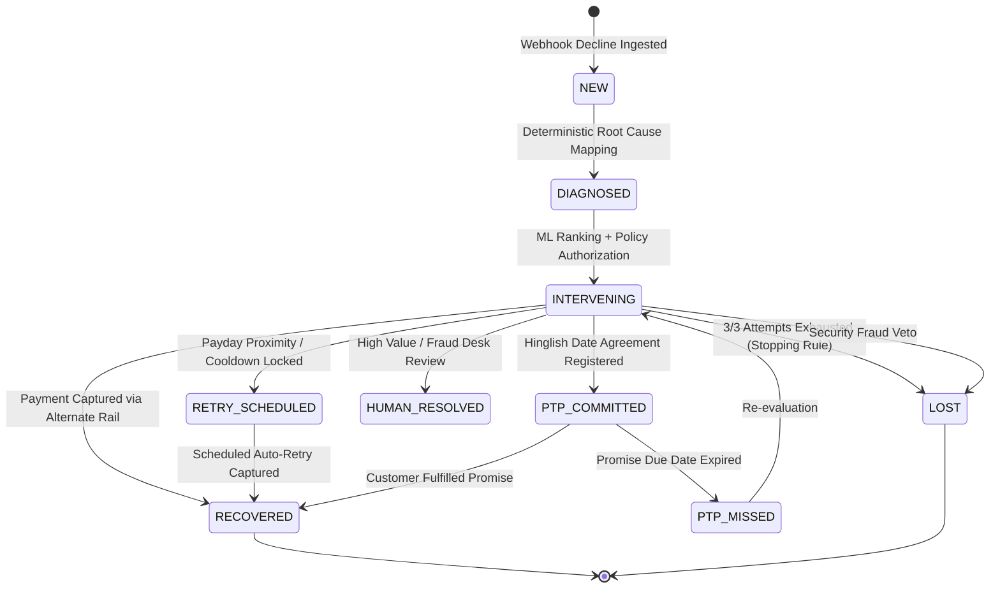

# Triage — Cross-Workflow AI Revenue Recovery Control Plane

> **"Context determines what is possible. ML determines what is preferable. Deterministic policy determines what is permissible. The executor determines what actually happens. Every outcome feeds the recovery ledger and future decisioning."**

**Triage** is an autonomous, cross-workflow revenue recovery control plane that detects revenue at risk across all commercial surfaces, diagnoses root causes with zero hallucination, plans bounded intervention sequences, prioritizes actions by marginal Expected Recovery Value ($\text{ERV}$), coordinates competing dunning workflows, executes policy-authorized recoveries, and proves measured money recovered with an immutable SHA-256 cryptographic audit trail.

Built for **Razorpay AI Buildathon Track 03: AI Revenue Recovery** (*Find revenue that’s slipping away and win it back*).

---

## 1. What Razorpay Has Today vs. What Triage Adds

While Razorpay provides industry-leading payment gateway processing, standard subscription dunning schedules, and basic webhook retry queues, it operates within product-isolated silos. Triage provides the overarching AI control plane that turns payment failures and overdue receivables into bounded, optimized recovery loops:

| # | Capability | Razorpay Native Behavior (with Official Docs Citation) | Triage AI Control Plane (New) |
|:---:|---|---|---|
| **1** | **Cross-Workflow Coordination** | **Siloed per product**: [Razorpay Subscriptions](https://razorpay.com/docs/subscriptions/) and [Razorpay Invoices](https://razorpay.com/docs/invoices/) operate on disjoint state machines with separate dunning cycles. No cross-product customer entity, contact limiter, or global fatigue cooldown. | **Centralized Customer Entity**: Coordinates recovery across all 6 commercial surfaces; enforces a mandatory 4-hour global contact cooldown and value-ranked suppression. |
| **2** | **Dual-Gated Concession Solvency Engine** | **Static merchant offers**: [Razorpay Offers API](https://razorpay.com/docs/payments/offers/) supports flat/percentage discounts configured manually at the order level, not computed dynamically against an individual customer's solvency gap. | **2-Gate Knapsack Solver**: Gate 1 deterministic gap-closing check ($\text{bal} \ge \text{amt} - \text{concession}$) + Gate 2 marginal ERV density portfolio budget allocator. |
| **3** | **Payday-Aware Adaptive Sequencer** | **Fixed daily schedule**: [Razorpay Subscriptions Payment Retries](https://razorpay.com/docs/subscriptions/payment-retries/) retries on a fixed T+1, T+2, T+3 day cycle regardless of decline reason — not liquidity-timed (exhausts attempts while account is empty). | **Payday Proximity Sequencer**: Times retries to customer salary liquidity windows ($\le 3$ days), executing debits when funds actually land in the bank account. |
| **4** | **Conversational Hinglish & Promise-to-Pay (PTP)** | **Static SMS / email links**: Production dunning uses standard notification templates. Razorpay specifically identified conversational voice & PTP trackers as the core frontier in the [Razorpay AI Buildathon Track 03](https://razorpay.com/). | **NLP & Voice PTP Engine**: Extracts conversational dates (*"parso karunga"* / *"5 tarik"*) into structured schedules, tracking stateful `PTP_COMMITTED` $\to$ `RECOVERED`/`PTP_MISSED` transitions. |
| **5** | **Instrument Invalidation Candidate Bounds** | **Blind daily retries**: [Razorpay Retries Documentation](https://razorpay.com/docs/subscriptions/payment-retries/) confirms the engine retries the same card even on expired cards until attempts exhaust and status becomes `halted`. | **Strict Candidate Bounds**: Sets $\hat{P}(\text{recover}\|\text{same\_rail}) = 0$ on expired cards/revoked mandates, pruning blind retries and shifting instantly to alternate rails or update links. |
| **6** | **Cryptographic Audit Ledger & Provenance** | **Ephemeral webhook retries**: [Razorpay Webhooks](https://razorpay.com/docs/webhooks/) retries payloads on a 24-hr backoff and disables if failing; lacks an immutable, cryptographic hash-chained audit trail. | **SHA-256 Audit Ledger**: Cryptographically hash-chained ledger storing state transitions, idempotency keys, and tamper-evident financial receipts over real-time SSE. |
| **7** | **Counterfactual Uplift & "The Bar" Benchmark** | **Aggregate volume metrics**: [Razorpay Success Rate Analytics](https://razorpay.com/docs/analytics/success-rate-dashboard/) reports gross success rates and failovers, but provides no causal/counterfactual policy testing framework. | **3-Model Benchmark Harness**: Evaluates Ledger AI vs. Static Rule vs. Random Policy under identical held-out Bernoulli conditions, proving net ₹ recovered uplift ($p < 0.001$). |

---

## 2. Core Authority Pipeline

Triage separates non-authoritative generation (customer copy, conversational PTP) from authoritative idempotent execution:

```text
               REVENUE AT RISK SURFACES
 (Payment Degradation · Checkout Drop-off · Failed Subscription · B2B Overdue Invoice)
                                   │
                                   ▼
                            ┌──────────────┐
                            │ 1. DIAGNOSIS │
                            │What happened?│ → Deterministic failure mapping (8 Root Causes, 0 AI)
                            └──────┬───────┘
                                   │
                                   ▼
                           ┌───────────────┐
                           │ 2. ELIGIBILITY│
                           │What is possible│ → Context-aware candidate bounds & Gate 1 solvency check
                           └──────┬────────┘
                                   │
                                   ▼
                           ┌───────────────┐
                           │ 3. ML RANKING │
                           │What is better?│ → Random Forest estimates P(recover|x,a); Expected Recovery Value
                           └──────┬────────┘
                                   │
                                   ▼
                            ┌──────────────┐
                            │  4. POLICY   │
                            │What is allowed│ → Deterministic vetoes: max 3 attempts, ₹10k gate, fraud stop
                            └──────┬───────┘
                                   │
                                   ▼
                     5. APPROVED ACTION ENVELOPE
                     (Immutable Context & Boundary)
                                   │
                ┌──────────────────┴──────────────────┐
                │                                     │
                ▼                                     ▼
      COMMUNICATION BRANCH                    EXECUTION BRANCH
      (Non-Authoritative)                     (Authoritative / Idempotent)
                │                                     │
         ┌──────▼──────┐                       ┌──────▼──────┐
         │ 6. Template │                       │Deterministic│
         │    Nudge    │                       │  Executor   │
         └──────┬──────┘                       └──────┬──────┘
                │                                     │
         Output Validator                      Idempotency Check
                │                                     │
                ▼                                     ▼
         Customer Copy                         Authorized Recovery Action
                │                                     │
                ▼                                     ▼
         Customer Channel                      Razorpay API / Alternate Rail
                │                                     │
                └──────────────────┬──────────────────┘
                                   │
                                   ▼
                          7. OUTCOME + AUDIT
                         ┌───────────────────┐
                         │ Outcome Observer  │
                         │ SHA-256 Ledger    │
                         └───────────────────┘
```

---

## 3. Scenario-to-Action Mapping Matrix

Every failure scenario maps to a deterministic eligibility envelope. Discounts and concessions are strictly gated and never offered outside their justified mathematical boundary.

| Revenue Loss Scenario | Root Cause Code | Primary Recovery Intervention | Discount Allowed? | Justification & Policy Rules |
|---|---|---|---|---|
| **Insufficient Balance** *(Solvency Gap)* | `INSUFFICIENT_FUNDS` | **`INCENTIVE_DISCOUNT`** *(5% Instant Concession)* | **YES (Only Scenario)** | **Dual-Gated**: Requires Gate 1 (Gap closing: $\text{bal} \ge \text{amt} - \min(0.05 \times \text{amt}, 500)$) **AND** Gate 2 (Knapsack marginal ERV density fit). |
| **Insufficient Balance** *(Payday Near)* | `INSUFFICIENT_FUNDS` | **`RETRY_NEXT_PAYDAY_WINDOW`** | NO | When customer balance is below the concession gap but payday proximity is $\le 3$ days, schedules automated retry when funds clear. |
| **Insufficient Balance** *(Alternate Card)* | `INSUFFICIENT_FUNDS` | **`SWITCH_TO_SAVED_CARD`** | NO | When customer has a verified secondary card on file, prompts 1-tap switch without eroding merchant revenue. |
| **Insufficient Balance** *(Verbal Agreement)* | `INSUFFICIENT_FUNDS` | **`PROMISE_TO_PAY`** | NO | Hinglish conversational extraction parses customer commitment date (e.g. *"5 tarik ko payment kar dunga"*) into a structured promise. |
| **Bank Gateway Downtime** | `BANK_DOWNTIME_TIMEOUT` / `504` | **`RETRY_SAME_RAIL_COOLDOWN`** | NO | Infrastructure failure. Offering a discount is irrational. System enforces off-peak cooldown retry or rail switch. |
| **Expired Card / Invalid Instrument** | `EXPIRED_CARD` / `CARD_EXPIRED` | **`UPDATE_PAYMENT_METHOD`** | NO | Instrument invalidation. Retrying the same card is blocked by Candidate Bounds. Dispatches 1-click tokenized card update link. |
| **3DS / OTP Drop-off** | `OTP_DROP_OFF` / `3DS_DROP_OFF` | **`RESUME_CHECKOUT`** | NO | Customer was already in high-intent conversion. Dispatches 1-click cart resumption link with saved session state. |
| **Failed Subscription / Mandate Revoked** | `MANDATE_REVOKED` / `MANDATE_LIMIT` | **`SWITCH_TO_AVAILABLE_ALTERNATE_RAIL`** *(One-Time UPI)* | NO | Solved by switching to One-Time UPI intent or dispatching 1-click mandate reauthorization link (`REAUTHORIZE_MANDATE`). |
| **B2B Overdue Receivables** | `OVERDUE_INVOICE` | **`COLLECT_OUTSTANDING_PAYMENT`** | NO | Triggers structured enterprise invoice settlement workflow with cross-workflow dunning deconfliction. |
| **Suspected Fraud** | `FRAUD_SUSPECTED` | **`STOP`** | NO | Deterministic safety rule: immediate freeze on automated recovery, zero retry, and platform-wide dunning halt. |
| **High Value ($\ge \text{₹}10,000$)** | Any High Value | **`ESCALATE_HUMAN`** | Policy Bound | Bypasses automated dunning and routes directly to Senior Retention/Risk Desk for manual high-touch outreach. |
| **Exhaustion ($\ge 3$ Attempts)** | Any Repeated | **`MARK_LOST_EXHAUSTED`** | NO | Hard stopping rule: halts all automated recovery after 3 failed attempts to maintain merchant compliance and reputation. |

---

## 4. Key Architectural Decisions

### Decision 1: The Dual-Gated Solvency Concession Engine
* **The Problem**: Static or unconstrained discounting burns margin on customers who either don't need it or where the gap is too wide to close.
* **The Architecture**:
  1. **Gate 1 — Deterministic Solvency Check (Per-Case)**:
     $$\text{AvailableBalance} < \text{InvoiceAmount} \quad \text{AND} \quad \text{AvailableBalance} \ge \text{InvoiceAmount} - \min(0.05 \times \text{InvoiceAmount}, \text{₹}500)$$
     If this fails, the concession is **strictly forbidden**.
  2. **Gate 2 — Knapsack Budget Solver (Portfolio-Level)**:
     $$\max \sum_{i} \text{ERV}_i \quad \text{s.t.} \quad \sum_{i} \text{Concession}_i \le \text{DailyConcessionBudget}$$
     Ranks eligible cases by marginal ERV density: $\frac{\text{ERV}_{\text{with\_discount}} - \text{ERV}_{\text{without\_discount}}}{\text{ConcessionAmount}}$.
* **Integrity**: Gate evaluations are authoritative in the Go backend (`eligibility.go`). No hardcoded case IDs or client-side bypasses exist.

### Decision 2: Cross-Workflow Customer Coordination
* **The Problem**: When a merchant customer experiences an abandoned checkout, a failed recurring subscription, and an overdue invoice simultaneously, uncoordinated systems send 3 conflicting emails in the same hour, degrading brand trust.
* **The Architecture**:
  - Centralized customer entity coordinating across all 6 surfaces.
  - Enforces a mandatory **4-hour global contact cooldown**.
  - Ranks competing opportunities by value: prioritizes high-value checkouts (e.g. ₹18,000) and suppresses lower-value dunning (e.g. ₹4,200 subscription) until the primary issue resolves.

### Decision 3: Strict Accounting Invariant
* **The Invariant**: A transaction is **only** marked `RECOVERED` when real money is captured via verified payment gateway callback (`RecordCapture()`).
* **Integrity**: Scheduling a payday retry, registering a Promise-to-Pay (PTP), or updating a card leaves `amount_recovered = 0`. Downgrading an already-recovered case away from `RECOVERED` is cryptographically forbidden.

### Decision 4: Production ML Deployment Trade-Off
* **The Architecture**: While XGBoost achieved a marginal benchmark advantage (+10.73pp vs +6.82pp on synthetic partitions), Triage deploys a pure **Random Forest Classifier** to production.
* **The Trade-Off**: Eliminates native C++ compilation dependencies (`libxgboost`/`OpenMP`), prevents container version drift, and guarantees deterministic, 100% auditable tree traversal for regulatory financial compliance.

### Decision 5: Live Storefront Telemetry vs. Offline Benchmark
* **The Architecture**: The **Live Operations** cockpit (`OVERVIEW`) listens exclusively to real SSE webhooks from the customer storefront (`localhost:5173`). Cases are tagged as `LIVE · SANDBOX` (real browser actions in Razorpay test mode) or `LIVE · HMAC VERIFIED`.
* **Zero Dummy Data**: Root causes and operational KPIs are computed dynamically from live cases. Offline statistical evaluation is housed strictly in the **Batch Evaluation (`EVALUATION`)** harness.

---

## 5. Bounded State Machine

Triage enforces a deterministic, 5-stage finite state machine with strict termination guarantees:



---

## 6. Verification & Test Suite

### Running the End-to-End Validation Suite:
```bash
cd agent
python triage_scenarios.py --all
```

| Test Scenario | Validated Capability | Expected Outcome |
|---|---|---|
| **Scenario 1** | `INSUFFICIENT_FUNDS` + Payday Proximity | Selects `RETRY_NEXT_PAYDAY_WINDOW` (1-day proximity) |
| **Scenario 2** | `INSUFFICIENT_FUNDS` + Dual-Gate Concession | Authorizes 5% discount; closes solvency gap (₹2,400 $\to$ ₹2,280) |
| **Scenario 3** | `EXPIRED_CARD` Candidate Bounds | Zero blind retries; enforces `UPDATE_PAYMENT_METHOD` link |
| **Scenario 4** | High-Value Ceiling Veto | ₹12,500 invoice vetoed by $\ge \text{₹}10\text{k}$ rule $\to$ `ESCALATE_HUMAN` |
| **Scenario 5** | Hinglish Voice & NLP PTP Parser | Extracts "5 tarik" $\to$ schedules `PTP_COMMITTED` for 5th of month |
| **Scenario 6** | `FRAUD_SUSPECTED` Security Stop | Instant `STOP` action; halts automated dunning across customer |
| **Scenario 7** | Cross-Workflow Coordination | Multi-surface customer: ₹18k cart prioritized, ₹4.2k sub suppressed |
| **Scenario 8** | Simulation Clock & Scheduler | Advances sim-clock by 4h $\to$ triggers scheduled payday retry |
| **Scenario 9** | Maximum Attempt Exhaustion | 3/3 attempts triggers stopping rule $\to$ `MARK_LOST_EXHAUSTED` |
| **Scenario 10**| SHA-256 Ledger & Idempotency | Replayed webhooks return cached response; hash chain validated |

---

## 7. Quickstart

### 1. Configure SMTP Relay (Optional for Live Emails):
```bash
cp .env.example gateway/.env
# Edit gateway/.env with standard SMTP credentials (e.g. Gmail App Password):
# SMTP_HOST=smtp.gmail.com
# SMTP_PORT=587
# SMTP_USER=your-email@gmail.com
# SMTP_PASS=your-16-char-app-password
```

### 2. Start the Triage Gateway:
```bash
cd gateway
go run ./cmd/gateway/main.go
# API Server listening on http://localhost:8080
```

### 3. Run Go Unit Tests:
```bash
cd gateway
go test -v ./...
```

### 4. Start the Operations Dashboard:
```bash
cd dashboard
npm run dev
# Open http://localhost:3000
```

### 5. Start the Customer Storefront & Billing Portal:
```bash
cd storefront
npm run dev
# Storefront: http://localhost:5173
# Customer Portal: http://localhost:5173/portal
```
