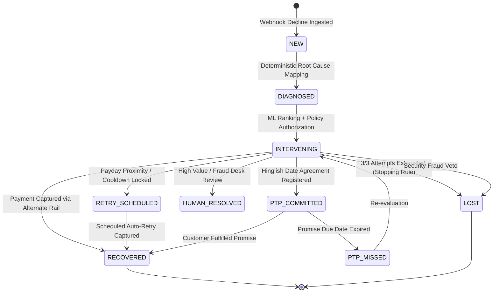

# Triage - Cross-Workflow AI Revenue Recovery Control Plane

[](https://drive.google.com/file/d/1uh3zhQRknUTt3QNnbQC6lrApSMwpoHKB/view?usp=sharing)
[](https://golang.org)
[](https://github.com/jhanvi857/Triage)
[](https://github.com/jhanvi857/Triage)

> Autonomous cross-workflow AI revenue recovery control plane that diagnoses payment failures, dynamically times retries to customer liquidity windows, de-conflicts multi-surface dunning, and executes bounded recoveries with an immutable SQLite-persisted, SHA-256 cryptographic audit trail.

---

## 1. Executive Overview: The 4 Core Problems Triage Solves

Failed payments, checkout drop-offs, and uncoordinated dunning represent a primary source of involuntary churn and lost revenue for recurring-revenue businesses. Modern payment platforms like Razorpay and Stripe provide essential recovery primitives: smart retries, tokenized card updates, webhooks, and automated notifications. However, these primitives typically operate within isolated product silos.

Triage operates as a higher-level cross-workflow control plane that unifies, times, and policy-governs recovery actions across all commercial surfaces under a single customer entity.

### The 4 Real-World Recovery Challenges and Triage Solutions:

1. **Liquidity-Aware Recovery Timing**:
   * *The Problem*: Generic or fixed retry schedules (such as daily T+1, T+2 retries) cannot account for an individual customer's real-time liquidity state, consuming attempt limits while the customer balance remains insufficient.
   * *Triage Solution*: Extends timing optimization with an explicit customer liquidity and **Payday Proximity Sequencer** (<= 3 days to salary deposit), scheduling retries when funds actually arrive.

2. **Dunning Collisions and Cross-Workflow Coordination**:
   * *The Problem*: When a customer experiences an abandoned checkout, a failed recurring subscription, and an overdue invoice simultaneously, disconnected systems fire competing notifications in the same hour, degrading customer trust.
   * *Triage Solution*: Centralized customer entity enforces a configurable **4-hour global contact cooldown** and value-ranked recovery prioritization (e.g. prioritizing an INR 18,000 cart checkout while temporarily holding dunning for an INR 4,200 subscription).

3. **Constrained Concession Optimization**:
   * *The Problem*: Flat or unconstrained discount promos erode merchant profit margin on customers who either do not need an incentive or whose balance gap is too wide to close.
   * *Triage Solution*: **Dual-Gated Knapsack Concession Engine** treats discounts as an optimized financial intervention: Gate 1 deterministically checks that the concession closes the customer shortfall (`balance >= amount - concession`), and Gate 2 allocates daily portfolio budget based on marginal ERV density.

4. **Conversational Payment Commitments (PTP)**:
   * *The Problem*: When customers explain payment delays in colloquial natural language (e.g., "5 tarik ko kar dunga"), standard automated gateways treat them as uncollected or lost.
   * *Triage Solution*: **Hinglish NLP Promise-to-Pay (PTP) Engine** parses conversational Indian date entities into stateful cron recovery schedules (`PTP_COMMITTED`), with strict accounting (INR 0 counted as recovered until funds settle).

---

## 2. Measured Financial Recovery Benchmark (750 Held-Out Cases)

> **Methodological Scope and Disclosure**:
> This benchmark evaluates decision logic correctness, candidate ranking, and policy veto adherence in a controlled counterfactual simulation environment. The 750 test cases represent a held-out test partition (15% split of 5,000 synthetic records, seed 42) evaluated against a designed multi-variable ground-truth probability distribution modeling real-world decline interactions (failure cause, payment rail, payday proximity, attempt count).
> While this rigorously validates that context-aware retries, Knapsack concessions, and secondary rail switches systematically outperform native static single-rule retries (+6.82 pp uplift, p < 0.001), it measures policy decision fit against a designed reward model rather than live production transactions. Live validation against merchant test-mode traffic is the subsequent operational milestone.

Evaluated under identical decline distributions (Gross Revenue at Risk: **INR 43,46,400.00** across 750 held-out test cases):

| Policy / Model | Recovery Rate (%) | Recovered INR (of INR 43.46L) | Absolute Uplift | Net Financial Gain | Latency (P99) | Statistical Significance |
|---|:---:|:---:|:---:|:---:|:---:|:---:|
| **Random Policy** (Uniform candidate selection) | 38.40% | INR 16,68,200.00 | -22.93 pp | -INR 9,97,500.00 | <0.1ms | Baseline reference |
| **Static Baseline** (Razorpay native 1-rule/cause) | 61.33% | INR 26,65,700.00 | Reference | Reference (INR 0) | <0.1ms | Reference |
| **Triage (Random Forest - Production)** | **68.15%** | **INR 29,62,000.00** | **+6.82 pp** | **+INR 2,96,300.00** | **5.83ms** | **p < 0.001** |
| **XGBoost** (Offline Benchmark Champion) | 72.06% | INR 31,32,000.00 | +10.73 pp | +INR 4,66,300.00 | 6.18ms | p < 0.001 |

> **Production Trade-off**: Random Forest (100 trees) was selected over XGBoost (+3.91 pp higher recovery) to avoid native C++ runtime dependencies (`libxgboost`/`OpenMP`) and guarantee deterministic, auditable tree traversal in financial workflows. In addition, an internal **pure Go embedded Random Forest (<1ms)** provides zero-downtime inference if the Python service is offline.

---

## 3. What Payment Platforms Provide Today vs. What Triage Adds as a Control Plane

| # | Capability Area | Gateway Primitives (Official Docs) | Triage Cross-Workflow Control Plane |
|:---:|---|---|---|
| **1** | **Concession & Discount Optimization** | **Static merchant offers**: Platforms provide coupon systems and flat/percentage order discounts configured manually at the merchant level. | **Policy-Constrained Concession Allocator**: Evaluates Gate 1 deterministic gap-closing check (`balance >= amount - concession`) plus Gate 2 marginal ERV density portfolio Knapsack budget optimization. |
| **2** | **Retry Timing & Liquidity Scheduling** | **Platform-level retry models**: Gateways provide Smart Retries and fixed interval retries (T+1, T+2, T+3) based on global network and processor telemetry. | **Liquidity-Aware Payday Sequencer**: Extends timing optimization with customer-specific liquidity window signals (payday proximity <= 3 days), timing retries to when customer funds land. |
| **3** | **Conversational Commitments (PTP)** | **Standard notification templates**: Platforms send automated failed-payment emails and SMS notifications with static checkout links. | **Text NLP PTP Engine**: Extracts conversational dates from customer text ("parso karunga", "5 tarik") into structured cron schedules, tracking stateful `PTP_COMMITTED` to `RECOVERED` or `PTP_MISSED` transitions. (Text-based; voice pipeline not included). |
| **4** | **Instrument Invalidation Bounds** | **Hard decline handling**: Permanent declines and halted subscriptions trigger manual card update links sent post-failure. | **Explicit Candidate Pruning**: Sets recovery probability to zero on expired cards and revoked mandates, pruning blind retries immediately and shifting to secondary rails or 1-click update links. |
| **5** | **Audit Trail & Financial Ledger** | **Ephemeral webhook logs**: Gateways provide webhook event deliveries with standard exponential retry windows (e.g. 24-hour webhook backoff). | **SQLite-Backed SHA-256 Ledger**: Cryptographically hash-chained ledger storing state transitions, idempotency keys, and tamper-evident financial receipts over real-time SSE, persisted to SQLite. |

---

## 4. End-to-End Decision Flow and Authority Pipeline

Triage runs a strict 5-stage authority pipeline separating non-authoritative communication from authoritative idempotent execution:

```text
               REVENUE AT RISK SURFACES
 (Payment Degradation / Checkout Drop-off / Failed Subscription / B2B Overdue Invoice)
                                   │
                                   ▼
                            ┌──────────────┐
                            │ 1. DIAGNOSIS │
                            │What happened?│ -> Deterministic failure mapping (8 Root Causes, 0 AI)
                            └──────┬───────┘
                                   │
                                   ▼
                           ┌───────────────┐
                           │ 2. ELIGIBILITY│
                           │What is possible│ -> Context-aware candidate bounds & Gate 1 solvency check
                           └──────┬────────┘
                                   │
                                   ▼
                           ┌───────────────┐
                           │ 3. ML RANKING │
                           │What is better?│ -> Dual-Mode Random Forest (Python first, Go embedded fallback)
                           └──────┬────────┘
                                   │
                                   ▼
                            ┌──────────────┐
                            │  4. POLICY   │
                            │What is allowed│ -> Deterministic vetoes: max 3 attempts, INR 10k gate, fraud stop
                            └──────┬───────┘
                                   │
                                   ▼
                     5. APPROVED ACTION ENVELOPE
                     (Immutable Context & Boundary)
                                   │
                ┌──────────────────┴──────────────────┐
                │                                     │
                ▼                                     ▼
      COMMUNICATION BRANCH                    EXECUTION BRANCH
      (Non-Authoritative)                     (Authoritative / Idempotent)
                │                                     │
         ┌──────▼──────┐                       ┌──────▼──────┐
         │ 6. Template │                       │Deterministic│
         │    Nudge    │                       │  Executor   │
         └──────┬──────┘                       └──────┬──────┘
                │                                     │
         Output Validator                      Idempotency Check
                │                                     │
                ▼                                     ▼
         Customer Copy                         Authorized Recovery Action
                │                                     │
                ▼                                     ▼
         Customer Channel                      Razorpay API / Alternate Rail
                │                                     │
                └──────────────────┬──────────────────┘
                                   │
                                   ▼
                          7. OUTCOME + AUDIT
                         ┌───────────────────┐
                         │ Outcome Observer  │
                         │ SQLite + SHA-256  │
                         └───────────────────┘
```

### The 5 Stages of Recovery Decisioning

1. **Deterministic Diagnosis (0 AI)**:
   * Maps raw decline codes (`INSUFFICIENT_FUNDS`, `GATEWAY_TIMEOUT_504`, `TRANSACTION_TIMEOUT`, `LIMIT_EXCEEDED`, `CARD_EXPIRED`, `OVERDUE_INVOICE`) and metadata into universal root causes. No generative guessing, 100% deterministic code rules.

2. **Context-Aware Eligibility and Candidate Bounds**:
   * Inspects customer context: available balance, payday proximity, verified backup cards on file, UPI availability, and remaining attempt limits.
   * Enforces **Gate 1 Solvency Check** for discounts: `AvailableBalance < InvoiceAmount` AND `AvailableBalance >= InvoiceAmount - min(0.05 * InvoiceAmount, 500)`.
   * Prunes impossible actions (e.g., zero blind retries on expired cards or revoked mandates).

3. **Dual-Mode Random Forest ML Inference (34 Features)**:
   * **Feature Vector**: Vectorizes **12 raw contextual feature fields** (9 numerical/temporal: `amount_paise`, `attempt_number`, `time_since_failure_hours`, `day_of_week`, `hour`, `payday_proximity_days`, `historical_success_rate`, `previous_success_count`, `days_since_last_payment`; and 3 categorical: `cause`, `original_rail`, `candidate_action`), which expand via one-hot encoding into a **34-dimensional feature vector**.
   * **Dual-Mode Execution**: The Go gateway queries the Python ML microservice (`http://localhost:8000/rank`, 5.83ms P99) over HTTP. If the microservice is offline or unreachable, the gateway seamlessly executes the embedded Go Random Forest inference engine directly in-process (<1ms latency).
   * Computes predicted recovery probability P(recover | x, a) for eligible actions and sorts by Expected Recovery Value:
     `ERV = P(recover | x, a) * (Amount - Discount)`

4. **Deterministic Policy Engine and Hard Vetoes**:
   * Evaluates 5 immutable safety rules:
     * `CANDIDATE_LEGITIMACY`: Proposed action must exist in the context-eligible set.
     * `MAX_ATTEMPTS_LIMIT`: Current attempts must be < 3. When reaching 3, enforces `MARK_LOST_EXHAUSTED`.
     * `FRAUD_SECURITY_GATE`: If root cause is `FRAUD_SUSPECTED`, immediately vetoes with `STOP`.
     * `HIGH_VALUE_THRESHOLD`: If amount >= INR 10,000, routes to Senior Retention Desk (`ESCALATE_HUMAN`).
     * `CONCESSION_BUDGET_CAP`: Any concession discount must be <= 5% AND <= INR 500.

5. **Execution Envelope and Cryptographic SQLite-Backed SHA-256 Ledger**:
   * Executes authorized recovery actions via idempotent API calls (`idem_{case_id}`).
   * Broadcasts real-time events over Server-Sent Events (SSE) to the Live Operations dashboard.
   * Appends every state transition and financial settlement to the SQLite-persisted, SHA-256 hash-chained recovery ledger.

---

## 5. Cross-Surface Failure Scenarios and Resolutions

| Revenue Loss Scenario | Root Cause Code | Primary Recovery Intervention | Discount Allowed? | Justification and Policy Rules |
|---|---|---|---|---|
| **Insufficient Balance** (Solvency Gap) | `INSUFFICIENT_FUNDS` | **`INCENTIVE_DISCOUNT`** (5% Instant Concession) | **YES (Only Scenario)** | **Dual-Gated**: Requires Gate 1 (Gap closing: `balance >= amount - min(0.05 * amount, 500)`) AND Gate 2 (Knapsack marginal ERV density fit). |
| **Insufficient Balance** (Payday Near) | `INSUFFICIENT_FUNDS` | **`RETRY_NEXT_PAYDAY_WINDOW`** | NO | When customer balance is below the concession gap but payday proximity is <= 3 days, schedules automated retry when funds clear. |
| **Insufficient Balance** (Alternate Card) | `INSUFFICIENT_FUNDS` | **`SWITCH_TO_SAVED_CARD`** | NO | When customer has a verified secondary card on file, prompts 1-tap switch without eroding merchant revenue. |
| **Insufficient Balance** (Verbal Agreement) | `INSUFFICIENT_FUNDS` | **`PROMISE_TO_PAY`** | NO | Hinglish conversational extraction parses customer commitment date (e.g. "5 tarik ko payment kar dunga") into a structured promise. |
| **Bank Gateway Downtime** | `BANK_DOWNTIME_TIMEOUT` / `504` | **`RETRY_SAME_RAIL_COOLDOWN`** | NO | Infrastructure failure. System enforces off-peak cooldown retry or rail switch. |
| **Expired Card / Invalid Instrument** | `EXPIRED_CARD` / `CARD_EXPIRED` | **`UPDATE_PAYMENT_METHOD`** | NO | Instrument invalidation. Retrying the same card is blocked by Candidate Bounds. Dispatches 1-click tokenized card update link. |
| **3DS / OTP Drop-off** | `OTP_DROP_OFF` / `3DS_DROP_OFF` | **`RESUME_CHECKOUT`** | NO | Customer was already in high-intent conversion. Dispatches 1-click cart resumption link with saved session state. |
| **Mandate Limit Exceeded** (Per-Debit Cap) | `MANDATE_LIMIT` | **`SWITCH_TO_AVAILABLE_ALTERNATE_RAIL`** (One-Time UPI) | NO | **Dominant Action**: Per-debit cap breach affects only this transaction. The recurring mandate remains active for future cycles. One-Time UPI intent settles same-day without altering the mandate. |
| **Mandate Revoked / Cancelled at Bank** | `MANDATE_REVOKED` | **`REAUTHORIZE_MANDATE`** | NO | Permanent mandate cancellation at destination bank. Dispatches 1-click tokenized e-mandate reauthorization link. |
| **B2B Overdue Receivables** | `OVERDUE_INVOICE` | **`COLLECT_OUTSTANDING_PAYMENT`** | NO | Dedicated B2B invoice checkout workflow with net terms tracking and cross-workflow dunning deconfliction. |
| **Suspected Fraud** | `FRAUD_SUSPECTED` | **`STOP`** | NO | Deterministic safety rule: immediate freeze on automated recovery, zero retry, and platform-wide dunning halt. |
| **High Value (>= INR 10,000)** | Any High Value | **`ESCALATE_HUMAN`** | Policy Bound | Bypasses automated dunning and routes directly to Senior Retention/Risk Desk for manual outreach. |
| **Exhaustion (>= 3 Attempts)** | Any Repeated | **`MARK_LOST_EXHAUSTED`** | NO | Hard stopping rule: halts automated recovery after 3 failed attempts to maintain merchant compliance and reputation. |

---

## 6. Key Architectural Decisions

### Decision 1: The Dual-Gated Solvency Concession Engine
* **The Problem**: Static or unconstrained discounting burns margin on customers who either do not need it or where the balance gap is too wide to close.
* **The Architecture**:
  1. **Gate 1 - Deterministic Solvency Check (Per-Case)**:
     `AvailableBalance < InvoiceAmount AND AvailableBalance >= InvoiceAmount - min(0.05 * InvoiceAmount, 500)`
     If this fails, the concession is **strictly forbidden**.
  2. **Gate 2 - Knapsack Budget Solver (Portfolio-Level)**:
     `max sum(ERV_i) subject to sum(Concession_i) <= DailyConcessionBudget`
     Ranks eligible cases by marginal ERV density: `(ERV_discount - ERV_no_discount) / ConcessionAmount`.
* **Integrity**: Gate evaluations are authoritative in the Go backend (`eligibility.go`). No client-side bypasses exist.

### Decision 2: Cross-Workflow Customer Coordination
* **The Problem**: When a merchant customer experiences an abandoned checkout, a failed recurring subscription, and an overdue invoice simultaneously, uncoordinated systems send conflicting notifications in the same hour, degrading customer trust.
* **The Architecture**:
  * Centralized customer entity coordinating across all commercial surfaces.
  * Enforces a mandatory **4-hour global contact cooldown**.
  * Ranks competing opportunities by value: prioritizes high-value checkouts (e.g. INR 18,000) and suppresses lower-value dunning (e.g. INR 4,200 subscription) until the primary issue resolves.

### Decision 3: Strict Accounting Invariant
* **The Invariant**: A transaction is **only** marked `RECOVERED` when real money is captured via verified payment gateway callback (`RecordCapture()`).
* **Integrity**: Scheduling a payday retry, registering a Promise-to-Pay (PTP), or updating a card leaves `amount_recovered = 0`. Downgrading an already-recovered case away from `RECOVERED` is cryptographically forbidden.

### Decision 4: Production ML Deployment Trade-Off and Zero-Downtime Resilience
* **The Architecture**: While XGBoost achieved a marginal benchmark advantage on synthetic partitions, Triage deploys a pure **Random Forest Classifier** (`ml-service/train.py`, 100 estimators) to production.
* **The Trade-Off**: Eliminates native C++ compilation dependencies (`libxgboost`/`OpenMP`), prevents container version drift, and guarantees deterministic, 100% auditable tree traversal for financial compliance.
* **Resilience Architecture**: Production calls query the Python Random Forest service (`http://localhost:8000/rank`). If unreachable, an internal **pure Go embedded Random Forest** (`EmbeddedRank`, `<1ms`) evaluates all 100 trees directly in memory to guarantee zero gateway downtime.

### Decision 5: Live Telemetry vs. Offline Benchmark
* **The Architecture**: The **Live Operations** cockpit (`OVERVIEW`) listens exclusively to real SSE webhooks from the customer storefront. Cases are tagged as `LIVE · SANDBOX` or `LIVE · HMAC VERIFIED`.
* **Zero Dummy Data**: Root causes and operational KPIs are computed dynamically from live cases. Offline statistical evaluation is housed strictly in the **Batch Evaluation (`EVALUATION`)** harness.
* **Harness vs. Integration Suite Clarification**:
  * **Batch Evaluation Harness** (`dashboard` EVALUATION tab / `gateway/internal/batch/harness.go` & `ml-service/benchmark.py`): Simulates counterfactual policy executions across 750 held-out transactions to evaluate aggregate recovery rate uplift, statistical significance (p < 0.001), and action distributions.
  * **End-to-End Integration Suite** (`agent/triage_scenarios.py`): An automated integration runner executing live HTTP requests against the running Go Gateway to validate the 11 operational production flows.

---

## 7. Build Challenges, Architecture Realities and Engineering Disclosures

This section consolidates engineering challenges, failure recoveries, and implementation boundaries across the production codebase:

### Architecture Realities and Subsystem Disclosures

| Subsystem | Implemented Behavior | Primary Engine | Resiliency Fallback | Persistence Target |
|---|---|---|---|---|
| **Failure Diagnosis** | 100% deterministic mapping across 8 root failure causes. Zero generative AI or LLMs. | Pure Go (`diagnosis/engine.go`) | None needed (deterministic code rules) | Ephemeral request context |
| **Candidate Bounds** | Solvency checks and rail pruning (e.g., zero retries on expired cards). | Pure Go (`intervention/selector.go`) | Hard safety bounds | Ephemeral request context |
| **ML Action Scoring** | Dual-mode ranking of recovery actions by Expected Recovery Value (ERV). | Python FastAPI (`ml-service/serve.py`, 100-tree Random Forest, 34 features, 5.83ms P99) | In-process pure Go Random Forest (`mlclient/embedded_rf.go`, 34 features, <1ms inference) | Trained weights serialized in `model.joblib` and embedded `rf_model.json` |
| **Policy Enforcement** | Hard deterministic vetoes: max 3 attempts, INR 10,000 human desk escalation, fraud stop. | Pure Go (`gate/gate.go`) | Strict terminal rejection | In-memory budget manager + SQLite database |
| **Audit Ledger** | Cryptographic SHA-256 hash-chained log with tamper verification (`VerifyIntegrity`). | SQLite WAL Mode (`storage/storage.go`) + In-Memory Chain (`audit/audit.go`) | In-memory chain authoritative during runtime; synchronous SQLite write per event | SQLite table `audit_logs` (rehydrated via `LoadFromDB` on restart) |
| **Conversational PTP** | NLP parser extracting Indian date expressions ("parso", "5 tarik", "kal sham") into cron schedules. | Text regex and temporal dictionary (`ptp/parser.go`) | Explicit fallback to human desk | In-memory case state + recovery record |
| **Evaluation Suite** | Stochastic counterfactual policy simulation across 750 held-out cases. | Go Batch Harness (`batch/harness.go`) | Local benchmark metrics cache (`ml-service/metrics.json`) | In-memory evaluation report |

### 6 Key Technical Solutions and Honest Limitations

* **1. Deterministic Financial Guardrails (No LLMs in Decisioning)**
  * *Obstacle:* Relying on generative LLMs for payment decisioning introduces non-deterministic outputs, prompt injection vulnerabilities, and unauthorized discount commitments during checkout.
  * *Solution:* Built a strict **5-Stage Authority Pipeline** where Diagnosis (Stage 1) and Candidate Bounds (Stage 2) are 100% deterministic code rules. ML is isolated strictly to ranking expected recovery probability.

* **2. Low-Latency ML Inference (<1ms) Without Microservice Downtime**
  * *Obstacle:* Routing every transaction through an external Python service added network round-trips (5.83ms P99) and introduced a hard external runtime dependency during checkout.
  * *Solution:* Built an **embedded Random Forest inference engine in pure Go** inside the gateway binary that deserializes `rf_model.json` at startup, providing <1ms zero-network fallback if the Python service is offline.

* **3. Margin Erosion from Blind Discounting**
  * *Obstacle:* Standard recovery systems offer flat discounts blindly, cannibalizing profit on willing payers or offering discounts too small to bridge large solvency gaps.
  * *Solution:* Implemented a **Dual-Gated Knapsack Solver** where Gate 1 deterministically checks that the discount mathematically closes the shortfall, and Gate 2 optimizes portfolio budget allocation based on marginal ERV density.

* **4. Parsing Natural Hinglish for Promise-to-Pay (PTP)**
  * *Obstacle:* Standard date parsers failed on colloquial Hindi and English text promises (e.g., "5 tarik ko kar dunga", "parso payment ho jayegi").
  * *Solution & Limitation:* Developed a domain-specific NLP regex and temporal dictionary parser that extracts conversational Indian date entities into stateful cron recovery schedules (`PTP_COMMITTED`). (Text-based; voice pipeline not included).

* **5. Cross-Workflow Notification Fatigue and Dunning Collisions**
  * *Obstacle:* When a customer had an abandoned cart, a failed subscription, and an overdue invoice at once, separate product silos fired competing emails within minutes.
  * *Solution:* Unified customer recovery under a centralized entity with an authoritative **4-hour global contact cooldown** and value-ranked suppression.

* **6. Audit Persistence and Anti-Ghost Recovery**
  * *Obstacle:* In-memory hash chains disappear on gateway process restarts, while unverified dunning systems claim "recovered" status simply upon sending reminder emails.
  * *Solution:* Built an append-only **SHA-256 hash-chained audit ledger** persisted synchronously to SQLite in WAL mode (`audit_logs` table), with automatic chain rehydration on startup (`LoadFromDB`), rowid-guaranteed insertion ordering, and cryptographic tamper verification (`VerifyIntegrity`). Enforced the strict invariant that transactions only become `RECOVERED` when verified payment capture occurs.

---

## 8. Bounded State Machine and Validated Test Suites

### Bounded State Machine

Triage enforces a deterministic, finite state machine with strict termination guarantees:



### Validated Test Suites

#### 1. Go Unit Test Suites (42 Tests, 14 Packages, 0 Failures)

```bash
cd gateway
go test -v ./...
```

* `internal/allocator`: 3 tests (Small high-uplift vs large low-uplift, budget exhaustion, PTP reserve bucket).
* `internal/api`: 8 tests (Happy path purchase, budget rejection, high-value approval, idempotency deduplication, PTP zero-recovery accounting, email fraud suppression, retry attempt bounds, ML offline branding).
* `internal/audit`: 2 tests (SHA-256 cryptographic chain integrity, live SSE event broadcasting).
* `internal/budget`: 3 tests (Reserve/commit lifecycle, budget overflow protection, concurrent access safety).
* `internal/diagnosis`: 1 test (Coverage across all 8 payment failure causes).
* `internal/forecast`: 1 test (7-day cash flow projection calculations).
* `internal/gate`: 3 tests (Approved policy evaluation, over-budget rejection, high-value desk escalation).
* `internal/idempotency`: 1 test (Replay prevention and cryptographic request deduplication).
* `internal/intervention`: 2 tests (Contextual ML ranking and hard policy vetoes, PTP gating invariants).
* `internal/messaging`: 6 tests (Adversarial nudge validation, financial state isolation, approved action envelope, silent suppression, email policy rules, event dispatchers).
* `internal/mlclient`: 2 tests (Embedded Random Forest tree traversal, Go embedded inference execution).
* `internal/ptp`: 1 test (Deterministic extraction across colloquial Hinglish temporal phrases).
* `internal/razorpay`: 1 test (Sandbox mock order creation and mock capture lifecycle).
* `internal/recovery`: 10 tests (Root-cause plan termination, sim-clock advancement, coordinator suppression/cooldown, customer value scoring, hash chaining, direct mutation prevention, creation-as-recovered block, legitimate capture resave, status downgrade prevention).

#### 2. End-to-End Operational Scenarios (`agent/triage_scenarios.py`)

```bash
cd agent
python triage_scenarios.py --all
```

| Scenario | Validated Capability | Expected Outcome |
|---|---|---|
| **Scenario 1** | `INSUFFICIENT_FUNDS` + Payday Proximity | Selects `RETRY_NEXT_PAYDAY_WINDOW` (1-day proximity) |
| **Scenario 2** | `INSUFFICIENT_FUNDS` + Saved Card | Switches to secondary verified card without margin erosion |
| **Scenario 3** | `EXPIRED_CARD` Candidate Bounds | Zero blind retries; enforces `UPDATE_PAYMENT_METHOD` link |
| **Scenario 4** | High-Value Ceiling Veto | INR 12,500 invoice vetoed by >= INR 10k rule to `ESCALATE_HUMAN` |
| **Scenario 5** | Hinglish Text NLP PTP Parser | Extracts "5 tarik" to schedule `PTP_COMMITTED` for 5th of month |
| **Scenario 6** | `FRAUD_SUSPECTED` Security Stop | Instant `STOP` action; halts automated dunning across customer |
| **Scenario 7** | Cross-Workflow Coordination | Multi-surface customer: INR 18k cart prioritized, INR 4.2k sub suppressed |
| **Scenario 8** | Simulation Clock & Scheduler | Advances sim-clock by 4h to trigger scheduled payday retry |
| **Scenario 9** | Maximum Attempt Exhaustion | 3/3 attempts triggers stopping rule to `MARK_LOST_EXHAUSTED` |
| **Scenario 10**| SHA-256 Ledger & Idempotency | Replayed webhooks return cached response; hash chain validated |
| **Scenario 11**| Mandate Limit Breach | Shifts to One-Time UPI without altering recurring bank mandate |

---

## 9. Technology Stack at a Glance

| Component | Technology | Role and Key Responsibilities |
|---|---|---|
| **API Gateway & Control Plane** | **Go (Golang 1.22+)** | Authoritative 5-stage pipeline, deterministic Knapsack solver, embedded pure Go Random Forest (<1ms), Server-Sent Events (SSE) broadcast stream. |
| **Audit Ledger & Database** | **SQLite3 (WAL Mode)** | Cryptographic SHA-256 hash-chained state transitions, idempotency deduplication, immutable financial event log (`audit_logs` table). |
| **ML Ranking Microservice** | **Python (FastAPI, Scikit-learn)** | 100-estimator Random Forest scoring P(recover | action) across 34-dimensional feature vector (5.83ms P99 latency). |
| **Operations Cockpit** | **Next.js 14 (App Router, TailwindCSS, Lucide)** | Real-time SSE command center, live pipeline Kanban, batch counterfactual policy evaluator. |
| **Customer Storefront & Portal**| **React (Vite, TypeScript, TailwindCSS)** | Live sandbox checkout drop-off, conversational Hinglish PTP prompt bar, self-serve payment recovery portal. |

---

## 10. Quickstart (Local Setup)

### 1. Configure Environment:
```bash
cp .env.example gateway/.env
# Optional outbound SMTP configuration for live email nudges:
# SMTP_HOST=smtp.gmail.com
# SMTP_PORT=587
# SMTP_USER=your-email@gmail.com
# SMTP_PASS=your-16-char-app-password
```

### 2. Start the ML Ranking Service (Python Random Forest):
```bash
cd ml-service
python serve.py
# ML Service listening on http://localhost:8000 (loads model.joblib, 34 features)
```

### 3. Start the Triage Gateway (Go):
```bash
cd gateway
go run ./cmd/gateway/main.go
# API Server listening on http://localhost:8080 (queries ML service with Go embedded fallback resilience)
```

### 4. Run Go Unit Tests:
```bash
cd gateway
go test -v ./...
```

### 5. Start the Operations Dashboard:
```bash
cd dashboard
npm run dev
# Open http://localhost:3000
```

### 6. Start the Customer Storefront and Billing Portal:
```bash
cd storefront
npm run dev
# Storefront: http://localhost:5173
# Customer Billing Portal: http://localhost:5173/portal
# B2B Invoice Settlement: http://localhost:5173/invoice/inv_01
```

> **Concurrent Launch Option**:
> ```bash
> # Windows:
> start_services.bat
> # Linux / macOS:
> ./start_services.sh
> ```

---

Built for **Razorpay AI Buildathon Track 03: AI Revenue Recovery** (Find revenue that is slipping away and win it back).
