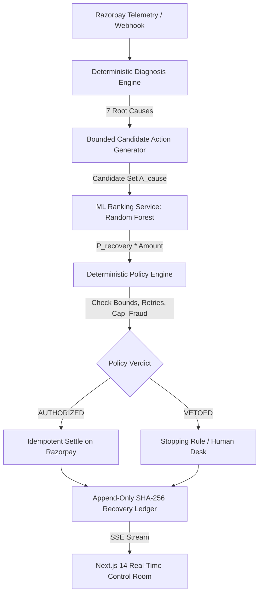

# Triage — Autonomous AI Revenue Recovery Architecture

> **"Triage is an autonomous AI revenue recovery engine for failed subscription and invoice payments. It combines deterministic diagnosis, machine-learned intervention ranking, and strict policy gating to recover at-risk revenue safely, idempotently, and auditably."**

> **"No LLM is used anywhere in Triage. Interventions are selected via a Random Forest ranking model over bounded action spaces, constrained by deterministic policy rules and logged to a SHA-256 hash-chained recovery ledger."**

---

## 1. System Philosophy & Non-Negotiables

```text
ML ranks bounded recovery choices.
Deterministic code diagnoses, authorizes, limits, executes, and audits.
```

- **Zero LLMs / Zero Generative AI**: No OpenAI, Gemini, Claude, ReAct agents, or LLM-generated customer outreach.
- **Zero AI in Diagnosis**: Telemetry is mapped deterministically from Razorpay error codes (`error_reason`, `error_source`, `error_step`, `description`) into 7 known root causes. Unclassifiable telemetry is flagged as `UNKNOWN_ERROR` requiring human review.
- **Zero AI in Financial Execution**: Model predictions are pure recommendations. The Deterministic Policy Engine enforces stopping rules, max retry bounds, concession limits, high-value thresholds, and fraud gating.
- **Zero Hallucinated Actions**: For every root cause, only a bounded whitelist of pre-approved candidates $\mathcal{A}(\text{cause})$ is scored.
- **Deterministic Customer Messaging**: Parameter substitution on fixed template matrices (`templates[Cause][Action]`).
- **Deterministic Promise-to-Pay (PTP)**: Regex matching for scheduled dates and confirmations; complex or ambiguous language routes to human retention desks.
- **Idempotent Execution**: Evora outbox pattern with SHA-256 idempotency keys prevents duplicate charges or concessions.
- **Cryptographic Auditability**: SHA-256 hash-chained ledger ensures tamper-evident traceability.

---

## 2. End-to-End Control Loop



---

## 3. Mathematical Formulation of the ML Ranking Engine

### 3.1 Objective Function
For a failure case with contextual feature vector $\mathbf{x} = (\text{cause}, \text{amount}, \text{attempt}, \Delta t_{\text{fail}}, \text{rail}, \text{hour}, \text{payday\_prox}, \text{hist\_rate})$ and permitted action candidate set $\mathcal{A}(\text{cause})$:

$$\text{Expected Value}(a) = \hat{P}(\text{recover} \mid \mathbf{x}, a) \times (\text{Amount} - \text{Concession}(a))$$

$$\text{Selected Recommendation } a^* = \arg\max_{a \in \mathcal{A}(\text{cause})} \text{Expected Value}(a)$$

### 3.2 Model Configuration
- **Algorithm**: Tabular `RandomForestClassifier(n_estimators=100, max_depth=8, min_samples_split=5)`
- **Evaluation Partitioning**: 70% Train, 15% Validation, 15% Held-Out Test (Case-level partition split)
- **Held-Out Test Metrics**:
  - ROC-AUC: `0.9884`
  - Precision: `93.96%`
  - Recall: `93.21%`
  - F1-Score: `0.9358`
  - Accuracy: `93.99%`
  - Absolute Recovery Uplift: `+5.47 percentage points` (54.40% Baseline $\rightarrow$ 59.87% ML Policy)
  - Relative Revenue Uplift: `+24.72%` (₹24.72L $\rightarrow$ ₹30.83L on ₹47.39L at-risk)

> **Evaluation Rigor & Methodology Disclosure**:
> These held-out metrics reflect the Random Forest ranking model accurately recovering the multi-variable contextual interaction effects ($\text{cause} \times \text{action} \times \text{context}$) hand-crafted into the synthetic simulation. This demonstrates that the expected-value ranking mechanism and candidate selection engine work mathematically end-to-end, rather than claiming production human behavioral prediction. In production, the model continuously fits to merchant-specific historical decline outcomes.

---

## 4. Deterministic Policy Engine & Stopping Rules

The Deterministic Policy Engine evaluates candidates in descending order of expected value against 5 safety checks:

```go
type PolicyRuleEvaluation struct {
    RuleName string `json:"rule_name"`
    Passed   bool   `json:"passed"`
    Reason   string `json:"reason"`
}
```

1. **`CANDIDATE_LEGITIMACY`**: Verifies $a \in \mathcal{A}(\text{cause})$.
2. **`MAX_ATTEMPTS_LIMIT`**: If $\text{Attempts} \ge 3$, retries are vetoed $\rightarrow$ `MARK_LOST_EXHAUSTED`.
3. **`FRAUD_SECURITY_GATE`**: Suspicious velocity or risk flags immediately halt automation $\rightarrow$ `STOP`.
4. **`HIGH_VALUE_THRESHOLD`**: Any transaction $\ge \text{₹}10,000$ (1,000,000 paise) is vetoed from automated dunning $\rightarrow$ `ESCALATE_HUMAN`.
5. **`CONCESSION_BUDGET_CAP`**: Financial discounts capped at 5% of amount and maximum ₹500 (50,000 paise).

---

## 5. Failure Taxonomy & Permitted Bounded Action Sets

| Root Cause | Permitted Action Candidates $\mathcal{A}(\text{cause})$ | Default Static Baseline Action |
|---|---|---|
| `BANK_DOWNTIME_TIMEOUT` | `RETRY_SAME_RAIL_COOLDOWN`, `SWITCH_RAIL_UPI`, `ESCALATE_HUMAN` | `RETRY_SAME_RAIL_COOLDOWN` |
| `INSUFFICIENT_FUNDS` | `RETRY_LATER`, `RETRY_NEXT_PAYDAY_WINDOW`, `INCENTIVE_DISCOUNT`, `ESCALATE_HUMAN` | `RETRY_LATER` |
| `EXPIRED_CARD` | `CUSTOMER_PAYMENT_LINK`, `SWITCH_RAIL_UPI`, `ESCALATE_HUMAN` | `CUSTOMER_PAYMENT_LINK` |
| `OTP_DROP_OFF` | `CUSTOMER_PAYMENT_LINK`, `RETRY_AUTHENTICATION`, `ESCALATE_HUMAN` | `CUSTOMER_PAYMENT_LINK` |
| `MANDATE_REVOKED` | `SWITCH_RAIL_UPI`, `INCENTIVE_DISCOUNT`, `ESCALATE_HUMAN` | `SWITCH_RAIL_UPI` |
| `FRAUD_SUSPECTED` | `STOP`, `ESCALATE_HUMAN` | `STOP` |
| `NETWORK_DECLINE` | `RETRY_SAME_RAIL_COOLDOWN`, `SWITCH_RAIL_UPI`, `ESCALATE_HUMAN` | `RETRY_SAME_RAIL_COOLDOWN` |
| `UNKNOWN_ERROR` | `ESCALATE_HUMAN`, `STOP` | `ESCALATE_HUMAN` |

---

## 6. Cryptographic Recovery Ledger (`gateway/internal/recovery`)

Every state transition calculates an immutable SHA-256 entry hash chained to the previous block:

$$\text{EntryHash}_n = \text{SHA-256}(\text{PrevHash}_{n-1} \parallel \text{CaseID} \parallel \text{Timestamp} \parallel \text{PrevStatus} \parallel \text{NewStatus} \parallel \text{ActionTaken} \parallel \text{AmountPaise})$$

Ledger updates are broadcast in real time over SSE to connected operations dashboards.
